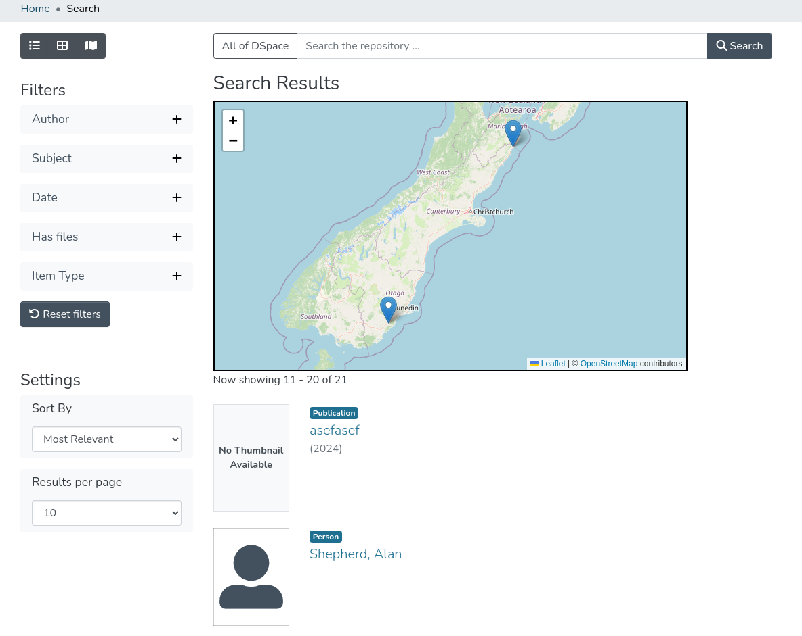

# Rendering geospatial data in maps in DSpace 9

With the introduction of the [GND data source and authority / relation representations](#TODO), it is now possible to render coordinates and polygons
in geospatial maps, in many different contexts.

The [leaflet.js](https://leafletjs.com/reference.html) map library is used along with the OpenStreetMaps Mapnik tile provider to
implement open maps that comply with the DSpace license and don't require any special API or tile service access.

## Usage

### Data types

Points are currently parsed as [WKT latitude and longitude coordinates](https://en.wikipedia.org/wiki/Well-known_text_representation_of_geometry) with some
cleanup occuring at the time of parsing to ensure that slighlty non-compliant values still work (e.g. capitalisation, inclusion of + operator).

It is then converted to GeoJSON.

Bounding boxes are currently parsed as [GeoJSON](https://en.wikipedia.org/wiki/GeoJSON)

### Declarative usage:

If you have one or more points or bounding box rectangles, pass them in as lists of strings, in the formats as above.


```
      <ds-geospatial-map [coordinates]="this.points"
                         [bbox]="this.bboxes"
                         [cluster]="this.cluster"
                         [layout]="'item'"
                         style="width: 100%;">
      </ds-geospatial-map>
```

A new `GeospatialItemPageField` handles this from an item page, instead of using a generic item page field.

The values of all the fields provided will be flattened into arrays for marker / box drawing, allowing for many different sources of point data
including virtual metadata fields.

```
    <!-- Below is an example of how to render one or more lat/lng points and/or bounding box rectangles
         in a tiled map viewer. Set 'cluster' to true for marker clustering -->
    <ds-geospatial-item-page-field [item]="object"
                                   [label]="'item.page.places'"
                                   [pointFields]="['dcterms.spatial']"
                                   [bboxFields]="['gnd.spatial.bbox']"
                                   [cluster]="true"
    >
```

Optional inputs `facetValues` (observable) and `mapInfo` (see `GeospatialMapDetail` model) are for browse and search results, respectively
as they need to provide more information about marker titles and click events.
## Examples

1. A map rendering a single point for a related GND subject (authority or relation), above an image depiction of another GND subject


2. A map rendering a single point and bounding box (retrieved as supplementary data from Geonames DB) for a related GND subject (authority or relation)


3. A map rendering two points and a bounding box from plain metadata values stored with the item, plus a clustered view. The fields are configurable.


4. A map "view mode" for search results (see the additional view mode toggle button in the upper left) shows point(s) for each item matching a configured
geospatial filter. The markers, when clicked, will redirect to the item page. This map also supports marker clustering.
(This is disabled by default but can be enabled for main search results)



5. A browse map for displaying facet values as geospatial points. The markers, when clicked, redirect to a search results page filtered by that point.
This map can be scoped by community or collection, and supports clustering.


**Further extension**:

It is trivial to extend or reuse the `GeospatialMapComponent` for other uses beyond the 5 scenarios described above - for example, it can be used
to easily display a static map in an about page, or in some usage statistics visualisations, and so on.

