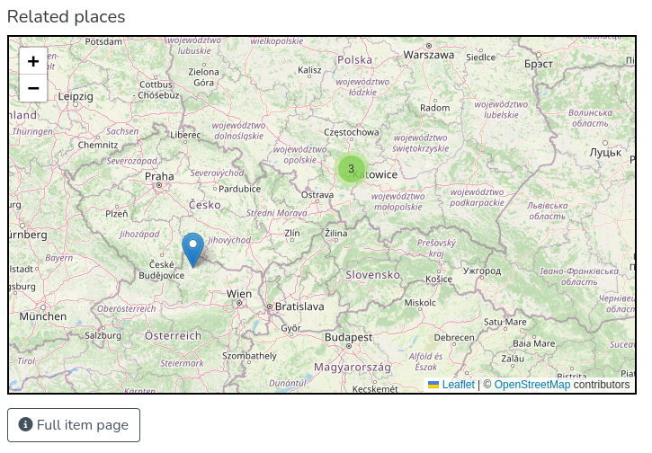

# Rendering geospatial data in maps for DSpace 9

With the introduction of the [GND data source and authority / relation representations](#TODO), it is now possible to render coordinates and polygons
in geospatial maps, in many different contexts.

The [leaflet.js](https://leafletjs.com/reference.html) map library is used along with the OpenStreetMaps Mapnik tile provider to
implement open maps that comply with the DSpace license and don't require any special API or tile service access.



## Configuration

See `geospatialMapViewer` config in dspace-angular `default-app-config.ts` for examples of frontend configuration of tile provider, map options, and enabling the search and browse maps.

```
  geospatialMapViewer: GeospatialMapConfig = {
    spatialMetadataFields: [
      'dcterms.spatial',
    ],
    spatialFacetDiscoveryConfiguration: 'geospatial',
    spatialPointFilterName: 'point',
    enableSearchViewMode: false,d
    enableBrowseMap: false,
    tileProviders: [
      'OpenStreetMap.Mapnik',
    ],
  };
```

**Discovery configuration**
For best use with search and browse, ensure there are appropriate search filters and facets set up for the metadata fields containing geospatial data (e.g. filter `point` indexing `dcterms.spatial`, referenced in a new discovery configuration called `geospatial`). This requires configuring `discovery.xml` in the DSpace spring configuration.

The [DSpace backend branch of this PR](#TODO) contains example discovery filters and also a useful 'has geospatial metadata' boolean filter which works similar to the 'has original content' filter, so that it is easy to narrow a search down to all items that *could* be drawn on a map

Tips:
* For the browse map to work, ensure the `geospatial` configuration is uncommented and named in `discovery.xml`, or some other configuration that includes the `searchFilterGeospatialPoint` filter and facet. The browse map essentially is a view on facet values for the `point` facet. The discovery configuration is named `geospatial` by default but the name is arbitrary and can be configured for the frontend in `geospatialMapViewer` config.
* For links from the browse map to work, it is recommended to include the `searchFilterGeospatialPoint` with your default search configuration, as clicking a marker on the browse page will redirect to a search filtered by that point (you could also customise which search configuration is used on marker click)

**Tiles and tile providers**
Any of the following tile providers can be configured (note that some may require authorized / API access): https://leaflet-extras.github.io/leaflet-providers/preview/.

The OpenStreetMap.Mapnik default tile provider is free, open and does not require credentials of any sort.

The value for `tileProviders` is an array because it is possible to include multiple tile layers in order. For example, I've successfully used OpenRailwayMap on top of Mapnik:


## Usage

### Data types

Points are currently parsed as [WKT latitude and longitude coordinates](https://en.wikipedia.org/wiki/Well-known_text_representation_of_geometry) with some
cleanup occuring at the time of parsing to ensure that slighlty non-compliant values still work (e.g. capitalisation, inclusion of + operator).

It is then converted to GeoJSON.

Bounding boxes are currently parsed as [GeoJSON](https://en.wikipedia.org/wiki/GeoJSON)

### Declarative usage:

**Declaring the core component**

If you have one or more points or bounding box rectangles, pass them in as lists of strings, in the formats as above.


```
      <ds-geospatial-map [coordinates]="this.points"
                         [bbox]="this.bboxes"
                         [cluster]="this.cluster"
                         [layout]="'item'"
                         style="width: 100%;">
      </ds-geospatial-map>
```

Optional inputs `facetValues` (observable) and `mapInfo` (see `GeospatialMapDetail` model) are for browse and search results, respectively
as they need to provide more information about marker titles and click events.

**Using in item pages**

A new `GeospatialItemPageField` handles this from an item page, instead of using a generic item page field.

The values of all the fields provided will be flattened into arrays for marker / box drawing, allowing for many different sources of point data
including virtual metadata fields.

```
    <!-- Below is an example of how to render one or more lat/lng points and/or bounding box rectangles
         in a tiled map viewer. Set 'cluster' to true for marker clustering -->
    <ds-geospatial-item-page-field [item]="object"
                                   [label]="'item.page.places'"
                                   [pointFields]="['dcterms.spatial']"
                                   [bboxFields]="['gnd.spatial.bbox']"
                                   [cluster]="true"
    >
```

## Examples

1. A map rendering a single point for a related GND subject (authority or relation), above an image depiction of another GND subject


2. A map rendering a single point and bounding box (retrieved as supplementary data from Geonames DB) for a related GND subject (authority or relation)


3. A map rendering two points and a bounding box from plain metadata values stored with the item, plus a clustered view. The fields are configurable.


4. A map "view mode" for search results (see the additional view mode toggle button in the upper left) shows point(s) for each item matching a configured
geospatial filter. The markers, when clicked, will redirect to the item page. This map also supports marker clustering.
(This is disabled by default but can be enabled for main search results)


5. A browse map for displaying facet values as geospatial points. The markers, when clicked, redirect to a search results page filtered by that point.
This map can be scoped by community or collection, and supports clustering.


## Files added / changed

### Components and models

* `src/app/shared/geospatial-map/` contains the core `GeospatialMap` component files and models
* `src/app/item-page/simple/field-components/specific-field/geospatial` contains the `GeospatialItemFieldPage` component files
* `src/app/browse-by/browse-by-geospatial-data/browse-by-geospatial-data.component.ts` is the "Browse-By" map component (disabled by default)
* `src/app/shared/object-geospatial-map/object-geospatial-map.component.ts` is the search results view mode that shows a map of clustered markers for items with geospatial data, as well as the [full] normal list of search result items.

### Other files

* `src/app/shared/utils/geospatial.functions.ts` is a set of utility functions for use in multiple components
* Configuration files are updated to include the new frontend configuration properties:
    * `src/config/app-config.interface.ts`
    * `src/config/default-app-config.ts`
    * `src/environments/environment.ts`
    * `src/environments/environment.test.ts`       


## Further extension

It is trivial to extend or reuse the `GeospatialMapComponent` for other uses beyond the 5 scenarios described above - for example, it can be used
to easily display a static map in an about page, an item representation, authority representation, or in some usage statistics visualisations, and so on.

